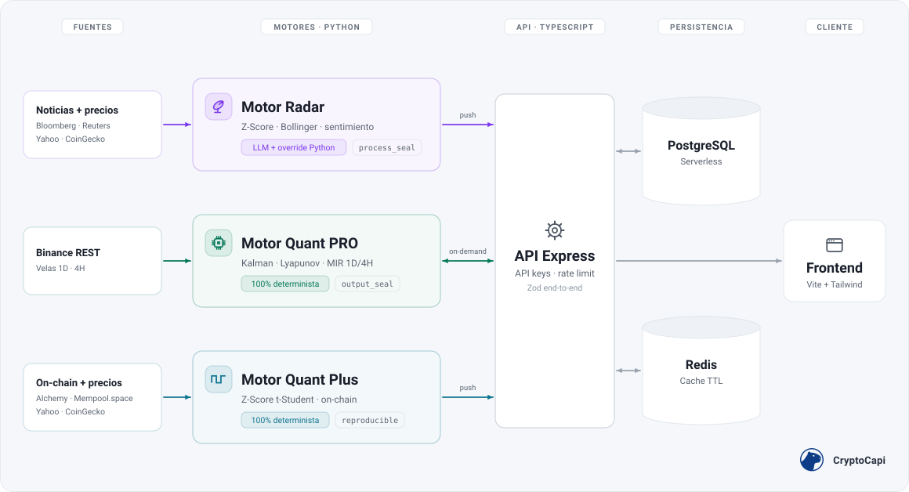

<div align="center">

<picture>
  <source media="(prefers-color-scheme: dark)" srcset="assets/logo-white.png">
  
</picture>

# CryptoCapi · Análisis Cuantitativo Sin Alucinaciones


Plataforma de análisis de criptomonedas con cuatro motores especializados: tres puramente matemáticos y uno con IA auditada por Python, para que los números nunca mientan.

<br/>


<br/>


</div>

---

## 📋 Tabla de Contenidos

- [El problema que resolvemos](#-el-problema-que-resolvemos)
- [Arquitectura · Cuatro Motores Especializados](#-arquitectura--cuatro-motores-especializados)
- [Pipeline Anti-Alucinación · Defensa en 4 Capas](#️-pipeline-anti-alucinación--defensa-en-4-capas)
- [Probalo ahora](#-probalo-ahora)
- [Stack Tecnológico Completo](#️-stack-tecnológico-completo)
- [Flujo de Datos](#-flujo-de-datos)
- [Principios de Ingeniería](#️-principios-de-ingeniería)
- [Outputs de ejemplo · Qué devuelve cada motor](#-outputs-de-ejemplo--qué-devuelve-cada-motor)
- [Nativo para agentes](#-nativo-para-agentes)
- [Documentación API](#-documentación-api)
- [Filosofía](#-filosofía)

---

## 🎯 El problema que resolvemos

> Los modelos de lenguaje **alucinan**. En finanzas, una alucinación cuesta dinero real.

CryptoCapi resuelve esto con una arquitectura donde la **IA solo interpreta narrativa** (noticias, sentimiento)
y **toda decisión numérica la calcula matemática verificable**: Z-Scores, filtros de Kalman, exponentes de
Lyapunov y datos on-chain leídos directamente de la blockchain.

<div align="center">

**No te decimos qué comprar. Te damos la matemática pura para que decidas vos.**

</div>

---

## 🧠 Arquitectura · Cuatro Motores Especializados

| Motor | Rol | Tecnología clave |
|:---|:---|:---|
| 📡 **Motor Radar** | Ingesta seis fuentes RSS verificadas (Cointelegraph, CoinDesk, Decrypt, The Block, Bitcoin Magazine, CryptoSlate) y genera sentimiento + resúmenes ejecutivos sin sensacionalismo. Cada fuente entra con su tier de credibilidad, y la matemática determinista valida o invalida la narrativa antes de publicarla. | `Python` · `LLM engine (multi-model)` · `feedparser` · `BeautifulSoup` |
| 📊 **Motor Quant PRO** | Señal cuantitativa on-demand sobre cualquier par de Binance: filtro de Kalman adaptativo para reducir ruido, exponente de Lyapunov para detectar caos de mercado y Matriz de Intercepción de Régimen (MIR) dual-timeframe 1D/4H. | `NumPy` · `SciPy` · `Pandas` · `TA-Lib` · `Binance REST` |
| 📈 **Motor Quant Plus** | Señales estadísticas pre-computadas sobre 50 períodos: Z-Score logarítmico con umbral t-Student (α=0.001 del modelo; con precios reales de cripto se cruza cerca de 1 de cada 75 días por moneda), enriquecimiento on-chain vía RPC (congestión de red, actividad de ballenas) e insight accionable con sello SHA-256 reproducible. | `NumPy` · `SciPy` · `Pydantic` · `Mempool RPC` |
| 🧭 **Motor Market Scan** | Ranking del universo curado por fuerza de señal, armado sobre las señales de Quant Plus. Deja fuera a las stablecoins mientras aguantan la paridad: si una se despega, vuelve al ranking, porque un *depeg* es una señal. | `TypeScript` · `PostgreSQL` |

### Cobertura por motor

| Motor | Universo de activos | Ejecución | Latencia típica |
|:---|:---|:---|:---|
| 📡 Radar | ~15 monedas curadas | Pre-computado (scheduler) | < 100 ms |
| 📊 Quant PRO | Cualquier par USDT de Binance | On-demand por request | ~2-3 s |
| 📈 Quant Plus | ~15 monedas curadas | Pre-computado (scheduler) | < 100 ms |
| 🧭 Market Scan | Universo curado de Quant Plus | Lee las señales de Quant Plus | < 100 ms |

> Las ~15 monedas curadas incluyen 10 fijas (BTC, ETH, SOL, BNB, XRP, DOGE, TRX, USDT, USDC, LEO) más hasta 5 adicionales seleccionadas dinámicamente por volatilidad ≥ 5% en 24h del top 20 por market cap.

---

## 🛡️ Pipeline Anti-Alucinación · Defensa en 4 Capas

> El LLM redacta la narrativa. **Python certifica los números y vigila las palabras.** La IA nunca tiene la última palabra sobre una cifra.

| Capa | Qué hace |
|:---|:---|
| **1 · Determinista** | Python calcula *todos* los valores numéricos (Bandas de Bollinger, Z-Score logarítmico, régimen de mercado) **antes** de invocar al LLM. |
| **2 · Narrativa** | Los valores deterministas se inyectan en el prompt como contexto *no negociable*; el LLM solo escribe texto sobre cifras ya fijadas. |
| **3 · Override numérico** | Tras la respuesta del LLM, Python **sobrescribe** métricas, sentiment y confidence con los valores deterministas. |
| **4 · Filtrado léxico** | Filtros deterministas eliminan frases alucinadas que sobrevivieron al prompt, usando *gates* basados en Z-Score y sentiment. |

**Umbrales fijos y a la vista:** cambios de volatilidad extrema o rupturas de bandas estadísticas disparan alertas automáticas. Una anomalía se declara cuando el Z-Score cruza el valor crítico de la t de Student (3,5051 con 48 grados de libertad), y ese umbral viaja en cada respuesta PRO como `z_score_threshold`.

La resiliencia de IA se apoya en **cadenas de fallback multi-modelo sobre buckets de cuota independientes** con *backoff* exponencial, de modo que ningún motor agote la capacidad de otro.

---

## 🚀 Probalo ahora

**Sin registro.** La demo key pública (limitada a BTC y ETH, 30 req/hora por IP) devuelve el payload Alpha completo, sello `audit_trail` incluido:

```bash
curl -H "x-api-key: demo_btc_eth_public" \
  "https://api.cryptocapi.com/v1/market/insights/bitcoin?view=alpha"
```

**En tu terminal.** El agente open source [anti-hallucination-crypto-agent](https://github.com/Jegoba90/anti-hallucination-crypto-agent) consume esta API en vivo, muestra qué eliminó o sobrescribió el pipeline sobre la salida de la IA (`filters_applied`, `fields_overridden`) y te enseña a verificar el `protocol_hash` por tu cuenta. Viene con la demo key precargada: clonar y ejecutar.

**Trial PRO de 14 días, sin tarjeta,** para el resto de monedas y los motores Quant: [cryptocapi.com](https://cryptocapi.com)

---

## 🛠️ Stack Tecnológico Completo

### 🎨 Frontend


> `Lightweight Charts` (TradingView) · `Swiper` · `jsVectorMap` · `Prism.js` · `DOMPurify` (sanitización XSS) · `date-fns` · `Temporal API`

### ⚙️ Backend / API


> `Helmet` · `CORS` · `express-rate-limit` · `compression` · `bcryptjs` · `Pino` (logging) · `email transaccional` · `Zod` (validación end-to-end)

### 🐍 Motor Cuantitativo (Python · Data Science)


> `TA-Lib` (análisis técnico) · `LLM engine (multi-model)` · `feedparser` · `BeautifulSoup4` · `cloudscraper` · `WebSockets` · `APScheduler`

### 🗄️ Datos & Persistencia


> PostgreSQL serverless · Redis gestionado · arquitectura cache-first con TTL

### ☁️ DevOps & Infraestructura


> Despliegue multi-servicio containerizado · `Docker Compose` (dev/staging/prod) · Container Registry

### ✅ Calidad & Testing


> Tipado estricto verificado con `Mypy` · `Pyright` · `type-coverage` · análisis de código muerto con `knip`

---

## 🔄 Flujo de Datos

<div align="center">

<picture>
  <source media="(prefers-color-scheme: dark)" srcset="assets/data-flow-dark.svg">
  
</picture>

</div>

---

## 📂 Estructura del Proyecto

El monorepo está organizado de forma clara y modular, separando la interfaz de usuario (Vite), la API (Node) y los servicios de recopilación/análisis cuantitativo (Python).

Conocé la distribución detallada de archivos y carpetas de cada módulo en el mapa de directorios:
👉 **[Mapa Detallado de Estructura del Proyecto (docs/project-structure.md)](docs/project-structure.md)**

---

## ⚖️ Principios de Ingeniería

> Reglas constitucionales que todo Pull Request debe cumplir.

- **Zero-Any**: prohibido `any` en TypeScript y Python; lo desconocido es `unknown` + *type guards*.
- **Tipos opacos de dominio**: `CoinId`, `WalletId` y `TransactionId` nunca son `string` planos; el compilador rechaza pasar un ID donde se espera otro, eliminando en compilación la clase entera de bugs "usé el identificador equivocado".
- **Exhaustividad verificada por el compilador**: todo `switch` sobre una unión discriminada cierra con `assertNever`; añadir un caso nuevo y olvidar manejarlo rompe el build señalando archivo y línea, nunca en producción.
- **Arquitectura Hexagonal**: el dominio nunca depende de la infraestructura; cambiar la base de datos no toca la lógica de negocio.
- **Contratos compartidos**: única fuente de verdad de tipos entre frontend y backend; nadie adivina la forma de la API.
- **Cronometría determinista**: `Temporal` API en lugar de `Date` nativo; sin errores de zona horaria/DST en software financiero.
- **Validación paranoica**: `Zod .strict()` por defecto en el backend + `Pydantic` en el collector; `.passthrough()` permitido solo en fronteras de confianza documentadas (engine interno, proveedor externo, config de infraestructura), nunca en entrada de usuario; validación bilateral antes de persistir.
- **Sello criptográfico verificable**: cada motor firma sus resultados con un `protocol_hash` SHA-256 sobre inputs/outputs deterministas; alterar cualquier campo cubierto invalida el sello (*tamper-evidence*). Semántica honesta por motor: `reproducible` (recalculable sin dependencias), `output_seal` (re-verificable contra el origen) y `process_seal` (certifica el proceso, no el texto del LLM).
- **Value Objects**: el dinero nunca es un `number` crudo; se encapsula inmutable para impedir estados inválidos.
- **Gestión explícita de recursos**: `using` / `await using` cierran las conexiones serverless automáticamente y evitan fugas.
- **Cache-First**: Redis gestionado con TTL delante de PostgreSQL en todo `GET` público.
- **Degradación honesta**: en modo *fallback*, la confianza reportada nunca es `HIGH`.
- **Type-safe de extremo a extremo**: verificado con `Mypy`, `Pyright` y `type-coverage`.
- **Quality Gate en CI**: GitHub Actions corre tipos, linters, tests (Jest, Vitest, Pytest), auditoría de dependencias y escaneo de secretos en cada push.
- **Seguridad & observabilidad**: `Helmet`, rate limiting, sanitización XSS (DOMPurify), `bcrypt`; error monitoring y logs estructurados.

---

## 🔬 Outputs de ejemplo · Qué devuelve cada motor

> Respuestas reales del sistema sobre **BTC**. Radar capturado el **2026-09-03** con la demo key pública; Quant Plus, el **2026-09-01**; Quant PRO, el **2026-05-25**. Son anteriores a `v2.3.0` (2026-10-01): los dos sellos dicen su `engine_version`, y [SEAL.md](docs/SEAL.md) explica qué regla aplica a cada versión. Los pesos internos de los indicadores no se publican.

<details>
<summary>📡 Motor Radar · Sentimiento sobre fuentes verificadas · sello audit_trail</summary>

```json
{
  "status": "success",
  "version": "1.0.0",
  "timestamp": "2026-09-03T23:04:24.278Z",
  "data": {
    "engine_used": "radar",
    "asset": { "id": "bitcoin", "symbol": "BTC" },
    "generated_at": "2026-09-03T23:04:24.278Z",
    "summary": "fortaleza estructural",
    "sentiment": "bullish",
    "statistical_anomaly_detected": false,
    "confidence": {
      "score": 0.95,
      "label": "HIGH"
    },
    "math_diagnostics": {
      "z_score": 2.2794,
      "z_score_threshold": 3.5051,
      "bollinger_bandwidth": 0.3225,
      "market_regime": "BULLISH_TREND",
      "extreme_volatility_detected": false,
      "data_quality": "OPTIMAL",
      "data_quality_reason": [],
      "sentiment_override": false,
      "anomaly_details": null,
      "regime_thresholds": {
        "volatility_hard_limit": 0.05,
        "z_score_anomaly_boundary": 3.5051,
        "daily_change_trend_boundary": 0.02
      },
      "audit_trail": {
        "protocol_hash": "0x4440a68517f2929f7c73a90835b8624f8f9861b6d43dca3c37646d351e4de18c",
        "calculated_at": "2026-09-03T23:04:24.207146Z",
        "seal_type": "process_seal",
        "algorithm_id": "Radar 4-Layer Anti-Hallucination Pipeline",
        "engine_version": "v2.2.0-radar",
        "filters_applied": [
          "LEY 7 volume"
        ],
        "fields_overridden": [
          "analysis.anomaly_details",
          "analysis.confidence",
          "analysis.detailed_report",
          "analysis.sentiment_score",
          "confidence",
          "is_volatility_alert"
        ],
        "sentiment_override": false
      }
    },
    "analysis": {
      "detailed_report": "El estado de las bandas indica COMPRESIÓN activa, sugiriendo acumulación de energía volátil previa a una posible expansión direccional. El Z-Score positivo confirma la fortaleza relativa del precio frente a la media móvil. En el frente macroestructural, se observa un pivote significativo en la industria minera: operadores como Hyperscale están desmantelando infraestructura de Bitcoin para contratos de Inteligencia Artificial de alto valor. Este fenómeno representa una reasignación estructural de capital y energía a largo plazo, aunque el impacto inmediato en la oferta circulante es marginal. La acción del precio actual responde a dinámicas técnicas de ruptura, mientras el fundamento sectorial evoluciona hacia la diversificación energética.",
      "sources_verified": [
        {
          "title": "Bitcoin Miner Ditches Site for AI Deal That Could Top $1.2 Billion",
          "url": "https://decrypt.co/377363/bitcoin-mine-ai-deal-1-2-billion",
          "credibility": "Tier 2"
        }
      ],
      "sources_window": "24h"
    }
  }
}
```

> El `audit_trail` declara qué corrigió Python sobre la salida del LLM: `fields_overridden` lista los campos sobrescritos con valores deterministas y `filters_applied`, los filtros léxicos que se dispararon. En esta captura saltó uno, `LEY 7 volume`, y el pipeline llegó a reescribir el propio `detailed_report`. Cómo verificar el hash: [SEAL.md](docs/SEAL.md). La respuesta va entera, sin recortar, y está commiteada tal cual en [api/examples/radar-alpha.json](api/examples/radar-alpha.json).

</details>

<details>
<summary>📊 Motor Quant PRO · Análisis cuantitativo multi-timeframe</summary>

```json
{
  "status": "success",
  "version": "1.0.0",
  "timestamp": "2026-05-25T20:18:36.005Z",
  "data": {
    "asset": { "id": "bitcoin", "symbol": "BTC" },
    "resolved_signal": "NEUTRAL_CHOP",
    "resolved_score": 52,
    "mir_diagnostics": {
      "base_raw_score": 55,
      "chaos_penalty_applied": true,
      "explanation": "Convicción direccional contraída por régimen de caos sistémico detectado."
    },
    "macro_1d": {
      "timeframe": "1d",
      "confluence_score": 55,
      "signal": "NEUTRAL_CHOP",
      "regime": {
        "lyapunov": 1.893,
        "status": "CHAOTIC",
        "signal_confidence": "LOW"
      }
    },
    "micro_4h": {
      "timeframe": "4h",
      "confluence_score": 60,
      "signal": "NEUTRAL_CHOP",
      "regime": {
        "lyapunov": 2.031,
        "status": "CHAOTIC",
        "signal_confidence": "LOW"
      }
    }
  }
}
```

</details>

<details>
<summary>⛓️ Motor Quant Plus · Sello reproducible y datos on-chain</summary>

Este es el motor cuyo sello **podés recalcular vos**. El vector de entrada abajo viene abreviado para que se lea; la respuesta completa, con sus 51 precios y sus 51 marcas de tiempo, está commiteada en [`api/examples/quant-plus-signal.json`](api/examples/quant-plus-signal.json), y **ese archivo verifica**: seguí los pasos de [docs/SEAL.md](docs/SEAL.md) y vas a obtener el mismo hash.

```json
{
  "status": "success",
  "version": "1.0.0",
  "timestamp": "2026-09-01T15:03:57.044Z",
  "data": {
    "engine_used": "quant_plus",
    "asset": { "id": "bitcoin", "symbol": "BTC" },
    "generated_at": "2026-09-01T15:03:57.044Z",
    "summary": "Lateralización en bandas normales, con leve presión bajista. Z-Score -0.67, al 19% de su umbral de anomalía (3.51).",
    "sentiment": "bearish",
    "statistical_anomaly_detected": false,
    "confidence": {
      "score": 0.64,
      "label": "MEDIUM"
    },
    "onchain_stats": {
      "network": "bitcoin-mainnet",
      "network_congestion": "LOW",
      "whale_activity_alert": true,
      "onchain_confidence_score": 0.9
    },
    "actionable_insight": {
      "signal": "HOLD",
      "risk_level": "LOW"
    },
    "math_diagnostics": {
      "z_score": -0.6651,
      "z_score_threshold": 3.5051,
      "bollinger_bandwidth": 0.3667,
      "market_regime": "RANGING_CHOP",
      "extreme_volatility_detected": false,
      "data_quality": "OPTIMAL",
      "sentiment_override": false,
      "anomaly_details": null,
      "audit_trail": {
        "protocol_hash": "0x821ba8b9ed9ecc1cca1b16c1d6feb902a7614cb027f2132a1b46d74e3fe3540a",
        "calculated_at": "2026-09-01T15:03:56.979793Z",
        "seal_type": "reproducible",
        "algorithm_id": "SMA-20 / 2σ / 50-period Z-Score (Returns)",
        "engine_version": "v2.2.0-math",
        "data_source": {
          "vendor": "Yahoo Finance (51 daily closes)",
          "symbol": "BTCUSDT",
          "timeframe": "1d (50-period log_returns Z-Score)"
        },
        "input_timestamps": ["2026-07-13T00:00:00Z", "…", "2026-09-01T00:00:00Z"],
        "input_vector": [62239.1211, "…", 77860.8281],
        "zscore_window_size": 49,
        "daily_change_pct": -0.5919
      }
    },
    "analysis": {
      "detailed_report": "Régimen de mercado: lateralización. Precio opera en el tercio inferior de las bandas de Bollinger. Z-Score (0.17) en zona neutral — sin anomalías estadísticas."
    }
  }
}
```

</details>

---

## 📖 Documentación API

| Documento | Descripción |
|:---|:---|
| [AUTHENTICATION.md](docs/AUTHENTICATION.md) | API keys, planes, rate limits y payload shaping por tier |
| [ENGINES.md](docs/ENGINES.md) | Universo de monedas, latencias, endpoints y cuándo usar cada motor |
| [SEAL.md](docs/SEAL.md) | Qué garantiza el sello Math Override Certified y cómo verificarlo |

---

## 🤖 Nativo para agentes

El API está pensado para que lo consuma una máquina, no solo una persona. Y desde 2026 hay tres caminos: el servidor MCP, el sitio legible por agentes y el descubrimiento por catálogos. Ninguno pide que escribas glue code.

### Servidor MCP nativo

Si tu cliente habla **Model Context Protocol**, no hace falta escribir integración: los motores son herramientas nativas.

```json
{
  "mcpServers": {
    "cryptocapi": {
      "command": "npx",
      "args": ["-y", "@cryptocapi/mcp"]
    }
  }
}
```

Eso es todo. Sin key, el paquete cae en la key pública de demostración y `get_insight` responde para bitcoin y ethereum, con su sello incluido.

| Herramienta | Motor | Qué devuelve |
|:---|:---|:---|
| `get_insight` | Radar o Quant Plus | Análisis de un activo. Con `engine="quant_plus"`, el sello reproducible y su vector de entrada |
| `get_signal` | Quant Pro | Señal de ejecución para un par de trading |
| `batch_signals` | Quant Plus | Señales de varios activos en una llamada |
| `scan_market` | Market Scan | Ranking del universo curado por fuerza de señal |

Cuatro herramientas, y **las cuatro son motores propios**. El dato de terceros (precios, macro) se retiró de esta superficie a propósito: por MCP viaja solo lo que nuestros motores firman.

El paquete es un **cliente delgado, no una segunda implementación**. Consume el mismo API público que cualquier otro consumidor y reenvía las respuestas **verbatim**, así que el `protocol_hash` que llega a tu agente es idéntico byte a byte al que sirvió el API. Se publica desde CI con **procedencia npm (SLSA)**, sin ningún token de larga vida: la única vía de publicar es un tag firmado sobre el repositorio público.

Y cuando un motor no está incluido en tu pase, el error lo dice con nombre propio y con un código que tu agente puede ramificar, en vez de un 403 pelado que lo deje reintentando en círculos.

Está dado de alta en el **registro oficial de MCP** como [`io.github.Jegoba90/cryptocapi`](https://registry.modelcontextprotocol.io/v0/servers?search=cryptocapi), con la propiedad del paquete verificada contra el tarball publicado en npm. Los clientes que leen ese registro lo encuentran sin que nadie les pase una URL.

### El sitio, legible por un agente

El sitio es una SPA renderizada en el cliente: hasta hace poco, cualquier ruta devolvía el mismo cascarón HTML de 44 KB. Un agente sin navegador se llevaba el marco y nada del contenido. Ya no.

**Agregá `.md` a la URL de una página y te devuelve esa página en markdown**, generada desde la página misma en cada despliegue:

```bash
curl https://www.cryptocapi.com/docs/agentes.md
```

| Documento | URL |
|:---|:---|
| Portada | [`/.md`](https://www.cryptocapi.com/.md) |
| Referencia del API | [`/docs/api.md`](https://www.cryptocapi.com/docs/api.md) |
| Guía de IA y agentes | [`/docs/agentes.md`](https://www.cryptocapi.com/docs/agentes.md) |
| Documentación | [`/docs.md`](https://www.cryptocapi.com/docs.md) |
| Metodología y verificación del sello | [`/methodology.md`](https://www.cryptocapi.com/methodology.md) |
| Términos | [`/terms.md`](https://www.cryptocapi.com/terms.md) |
| Privacidad | [`/privacy.md`](https://www.cryptocapi.com/privacy.md) |

> **Ramificá por el `Content-Type`, no por el código de estado.** Una URL `.md` sin espejo devuelve **200 con el cascarón HTML**, así que `text/markdown` es la única señal fiable de que el espejo existe. Es el error más fácil de cometer contra esta superficie, y por eso está escrito acá.

**Las vistas de mercado quedan fuera del espejo a propósito.** Precios, resumen de mercado y macro son dato de terceros que sirve el API; espejarlos como documentos convertiría el sitio en un feed gratis de aquello para lo que están los motores. La ausencia es una decisión, no un hueco.

### Descubrimiento: que no haya que adivinar nada

El dominio **anuncia dónde está todo lo legible por máquina** con una cabecera `Link` en cada respuesta, apuntando a dos catálogos:

| Catálogo | Qué es |
|:---|:---|
| [`/.well-known/api-catalog`](https://www.cryptocapi.com/.well-known/api-catalog) | Linkset **RFC 9727**: el documento OpenAPI, la referencia navegable y el endpoint de salud |
| [`/.well-known/ai-catalog.json`](https://www.cryptocapi.com/.well-known/ai-catalog.json) | Enumera todos los recursos legibles por máquina, uno por uno |

Y el contrato **se puede bajar, no solo mirar**: [`/v1/openapi.json`](https://api.cryptocapi.com/v1/openapi.json) sirve el documento OpenAPI en sí, no el Swagger UI. La proyección publicada filtra los servidores de desarrollo, así que un cliente generado no puede terminar apuntando a `localhost`.

Para clientes que no hablan MCP, el archivo [`llms.txt`](https://www.cryptocapi.com/llms.txt) **en vivo** es el índice de entrada: qué hace cada motor, cómo autenticarse, y desde dónde seguir hacia el resto de los documentos.

| Recurso | Para qué sirve |
|:---|:---|
| [`@cryptocapi/mcp` en npm](https://www.npmjs.com/package/@cryptocapi/mcp) | El servidor MCP nativo, con procedencia verificable |
| [`llms.txt` en vivo](https://www.cryptocapi.com/llms.txt) | Índice legible por agentes: motores, autenticación y a dónde ir después |
| [Contrato OpenAPI descargable](https://api.cryptocapi.com/v1/openapi.json) | El documento en sí, para generar un cliente |
| [Referencia navegable del API](https://api.cryptocapi.com/v1/docs) | El mismo contrato, para leerlo con ojos humanos |
| [Guía de IA y agentes](https://cryptocapi.com/docs/agentes) | Cómo integrar el API dentro de un flujo agéntico |

**Funciona donde construyas:** Claude Code · Cursor · GitHub Copilot · ChatGPT · LangChain · cualquier cliente REST.

¿Querés verlo funcionando? El agente open source [anti-hallucination-crypto-agent](https://github.com/Jegoba90/anti-hallucination-crypto-agent) consume este API en vivo y verifica el sello por su cuenta. Es el ejemplo ejecutable de todo lo anterior.

---

<div align="center">

## 💜 Filosofía

> ### *"Nosotros no te decimos qué comprar.*
> ### *Te damos la matemática pura para que decidas vos."*

<br/>

### Hecho con 💜 y matemática pura

**por el equipo de CryptoCapi**

Detrás de cada Z-Score hay gente que cree que los números no deberían mentirle a nadie.

<br/>

**Líder de proyecto:** Jesús González · [@Jegoba90](https://github.com/Jegoba90)

<br/>


<br/>

<a href="https://cryptocapi.com">
  <picture>
    <source media="(prefers-color-scheme: dark)" srcset="assets/logo-white.png">
    
  </picture>
</a>

</div>
